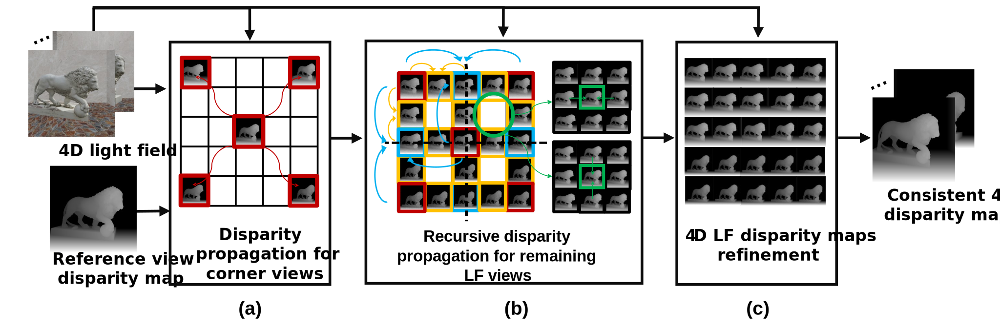

# Efficient Propagation Method for Angularly Consistent 4D Light Field Disparity Maps
[Maryam Hamad](https://www.it.pt/Members/Index/29930)1,2, 
[Caroline Conti](https://www.it.pt/Members/Index/4506)1,2,
[Paulo Nunes](https://www.it.pt/Members/Index/457)1,2
[Luís Ducla Soares](https://www.it.pt/Members/Index/511)1,2 
1Instituto Universitário de Lisboa (ISCTE-IUL), 2), Instituto de Telecomunicações  
IEEE Access, 2023: 
[Link to our paper](https://ieeexplore.ieee.org/document/10156827) 

 

## Dynamic results:
The dynamic reslults are available in this repository: 
<video width="320" height="240" controls>
  <source src="https://github.com/MaryamHamad/LFDisparityPropagation/blob/main/Disparity%20results.mp4" type="video/mp4">
  Your browser does not support the video tag.
</video>
